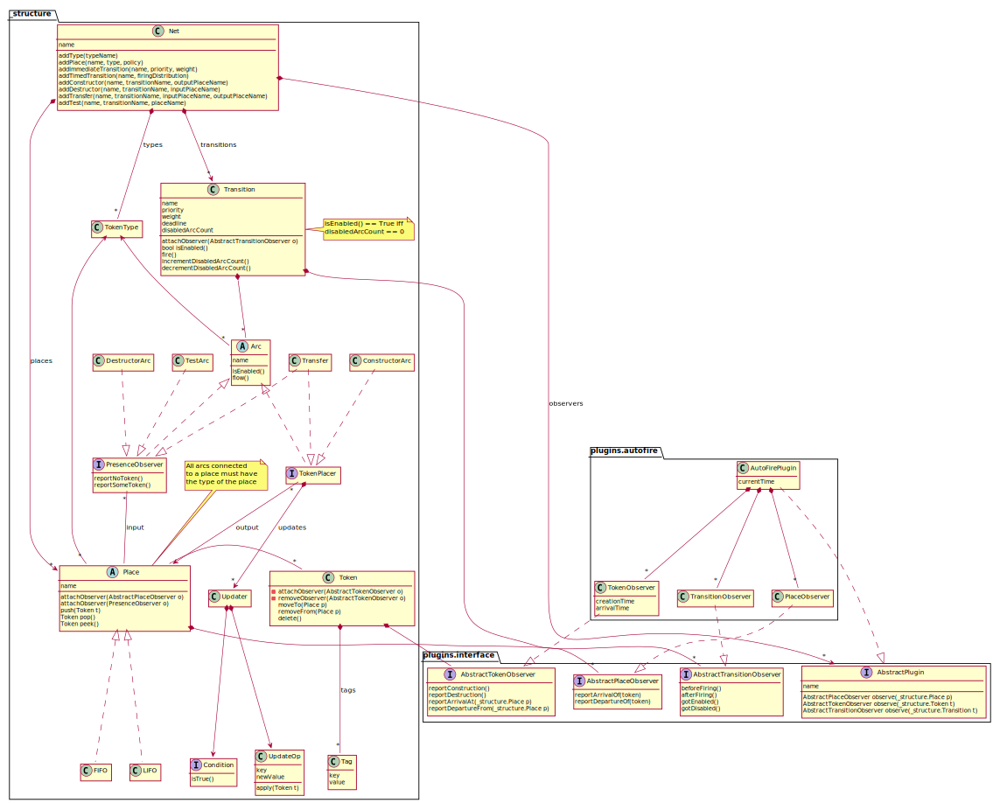
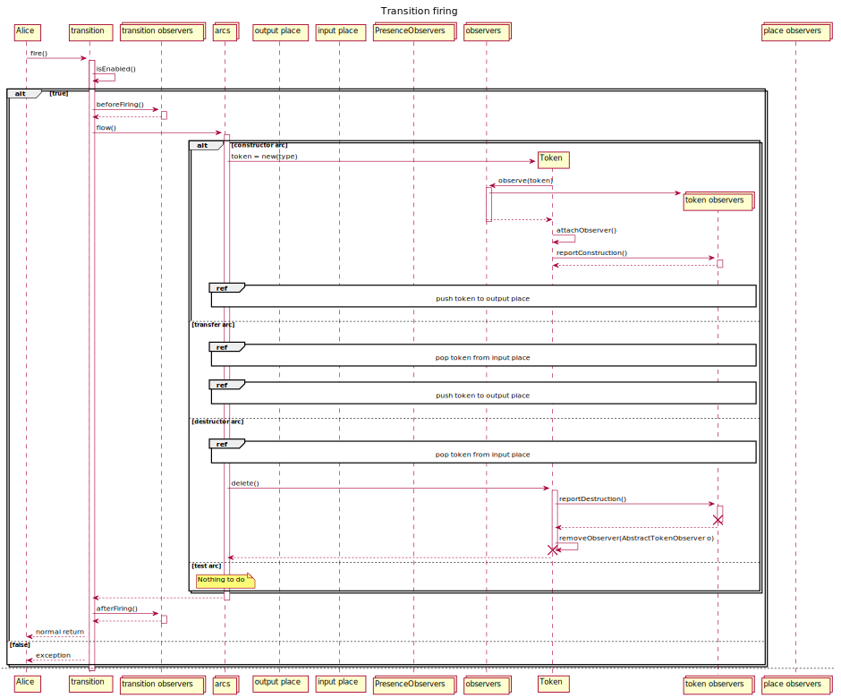
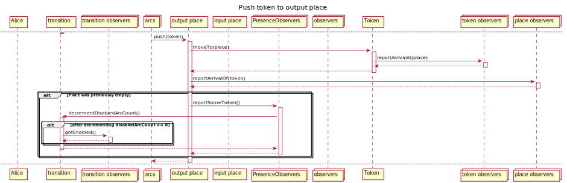
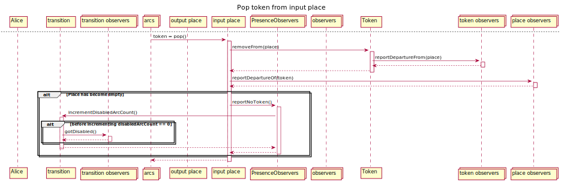

Design
================

For a functional overview, see :doc:`Semantics`.

Goals
--------------
.. rubric:: Support for interactive, explorative analysis

A GUI restricts the ways an analyst can interact with the functionality of a software library and hinders exploration.
Therefore no GUI is provided. The foreseen way of using `PetSi` is from an interactive session
like the ones provided `IPython <https://en.wikipedia.org/wiki/IPython>`_.

.. rubric:: Extensibility

The architecture of `PetSi` should support an incremental implementation approach,
core functionality added early and extended gradually, possibly without major rewrites.

.. rubric:: Performance

Use hardware resources efficiently.

.. rubric:: Scalability

`PetSi` should efficiently use the CPUs available in a computer cluster.

.. rubric:: Low entry barrier

New users should be able to quickly get started with PetSi and solving their problems fast. This implies:

- Good documentation (i.e. the one you are reading ;-) )
- Easy installation
- Plenty of practical examples

Choices
-----------------
We believe that one of the best options for interactive explorative analysis is brought by
`IPython <https://en.wikipedia.org/wiki/IPython>`_ with a Python kernel. Python is a
generic purpose programming language often acting as a the integrating *glue* between components written
in C, C++ Fortran, Java, etc. It comes with a plethora of libraries, so it is highly unlikely
that the lack of a library would prevent a `PetSi` user from concentrating on the problems he/she wants to solve.

Being an interpreted language, good performance is not trivial with Python. To address this issue,
all performance critical modules are written in `Cython <https://cython.readthedocs.io/en/latest/>`_.
Cython takes annotated Python code and translates it to C. Cython modules thus become compiled C extension
modules eliminating bytecode interpretation and most of the member-lookup overhead. What remains is the
reference counting and garbage collection overhead, as the underlying data structures are still Python objects.
To get rid of these the data structure of the Petri net would need to be rewritten in C or C++, taking care of
memory management manually.

In the current release of `PetSi` scalability is left to be addressed by the user e.g. with the
:class:`process pool <python:multiprocessing.pool.Pool>` implementation of the Python Standard Library.
Further support is planned in coming releases.

The goal for low entry barrier pushes for having as few dependencies as possible. This is the reason why e.g.
`PetSi` uses :class:`python arrays <python:array.array>` instead of Numpy ones.

How the objective of good extensibility is achieved is explained in the next section.

Internal structures
-------------------------
The drive for extensibility pushed for implementing the core data structures in a relatively small
module with much of even the basic functionality factored into
`observers <https://en.wikipedia.org/wiki/Observer_pattern>`_ watching the core structures. Below is the resulting
package hierarchy. Underscores indicate modules implemented in Cython.

Refer to the :ref:`package-hierarchy` for details on the package internals.

.. image:: package_hierarchy.svg
    :scale: 70%
    :align: center

The core data structures are in the :mod:`petsi._structure` module. The class diagram below
also shows their relation to the observers on the example of the :mod:`petsi.plugins.autofire` plugin.
This plugin is responsible for selecting the next transition

.. _design-internal-structures-interactions:

Interactions
.....................

The sequence diagrams below show the classes "in action".

    High level view on firing a transition.

    Pushing a token to an output place.

    Popping a token from an input place.

