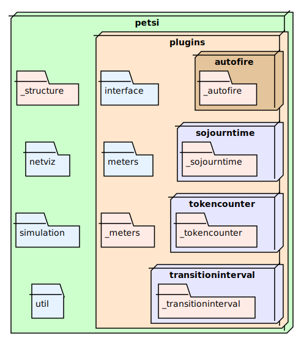

Package reference
=======================

Functional overview
-------------------------

Functionally, the `PetSi` API consists of multiple parts. Follow the links below to the documentations of the modules
that define the APIs. Some other links lead to examples on how to use these interfaces:

- For typical everyday use, the :doc:`simulation API <_generated/petsi.simulation>` is of interest.
  This API allows you to create Petri nets and run performance simulations.

.. _extension-mechanisms:

- `PetSi` has a modular, extensible internal architecture that allows for extending its built-in functionality.

  - The :doc:`plugin API <_generated/petsi.plugins.interface>` is for extending `PetSi` with additional functionality
    based on the `observer pattern <https://en.wikipedia.org/wiki/Observer_pattern>`_. The pluign you write
    will get notifications about tokens being constructed and destructed, arriving and leaving places,
    transitions becoming enabled or disabled. Internally, `PetSi` itself is
    a user of this interface to implement some of its built-in functionality, like automatically selecting and
    :doc:`firing transitions <_generated/petsi.plugins.autofire>`
    and :doc:`collecting metrics <_generated/petsi.plugins.meters>` about the places, transitions or tokens of the net.

  - The :doc:`visitor API <_generated/petsi.visitor>` allows for transforming the Petri net into alternate
    representations. An example of this is the :doc:`NetViz <_generated/petsi.netviz>` module visualizing
    the net with :mod:`graphviz`.

Encapsulation principle
-------------------------

To ensure a clear separation between interfaces and implementations, `PetSi` uses the following encapsulation
principles:

- The public members of the top level :mod:`petsi` package and the objects reachable by
  navigating these are considered the public API of `PetSi`.
  It is OK to access these from user code.

- Public members of :mod:`petsi`'s sub-modules or sub-packages should not be accessed
  from code outside the direct parent and sibling
  packages, unless a sibling exports them.

These principles can be summarized as the following rule of thumb:

.. topic:: Rule of thumb for importing from ``petsi``

    You can import an object from a ``petsi`` module if and only if it is possible
    to import it with a statement matching the following regular expression:

    .. code-block:: python

        from [.]*\w+ import \w+

According to the Python import rules, the presence of one or more dots in the import
statement implies that the module containing the import statement is part of `PetSi`,
i.e. uses one of the extension APIs.

The intended way of importing the members of each module is shown in the `Synopsis` section of
the corresponding documentation page.

.. _package-hierarchy:

Package hierarchy
-------------------------

Here is where you can start navigating the package hierarchy:

.. autosummary::
    :template: module_reference.rst
    :recursive:
    :toctree: _generated

    petsi

Alternatively you can refer to the :ref:`modindex`.