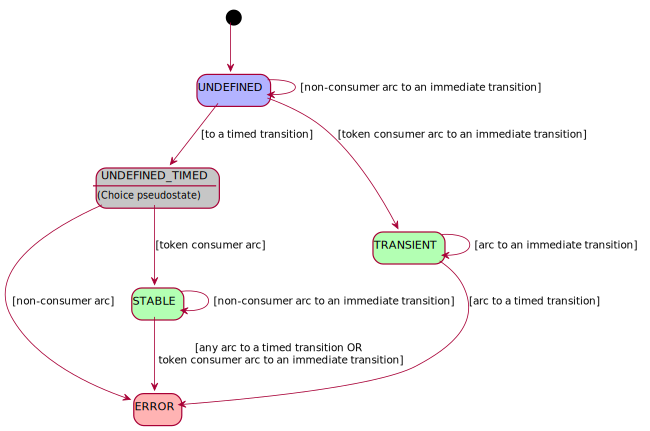

Supported Petri net semantics
======================================

This page first defines the flavour of Petri nets implemented in `PetSi` then provides
a few high level guidelines on mapping the defined elements to the concepts of distributed systems.
For a more general introduction refer e.g. to the
`Wikipedia article on Petri nets <https://en.wikipedia.org/wiki/Petri_net>`_.

Model elements and execution
---------------------------------

.. note::

    The model elements described here can be created with the help of the :class:`~petsi.simulation.Simulator` class.

A Petri net is a directed `bipartite graph <https://en.wikipedia.org/wiki/Bipartite_graph>`_,
on which a flow of tokens is interpreted. A vertex of the graph represents either a transition or
a place. Tokens flow along the directed edges called arcs, each of which
connects a place to a transition or a transition to a place.
The flow of the tokens happens in discrete, atomic steps when a transition fires
and is restricted to the arcs the transition is connected to. Between firings the tokens are stored
at the places. When the flow occurs, arcs perform some action on the flown tokens.
Atomicity means that either all or none of the arcs complete their flow actions. The transitions fire sequentially,
one after the other.

.. rubric:: Arcs

Based on their flow actions, we differentiate the following arc kinds:

- :class:`Presence observers <petsi._structure.PresenceObserver>` connect an *input place* to a transition.
  These kinds of arcs are sensitive to the presence or absence of a token at their input places and will prevent
  the transition from firing if the required conditions are not met.

  - `Non-consumers` are presence observers that do not remove any tokens from their input place

      - :class:`Test arcs <TestArc>` require the presence of a token at their inputs but do not move any tokens.
      - :class:`Inhibitor arcs <InhibitorArc>` require the absence of any tokens at their inputs.

  - `Token consumers` require the presence of a token and in some way remove the token from their input place

      - :class:`Destructor arcs <DestructorArc>` destroy the selected token.
      - `Input arcs` [#ref3]_ cooperate with `output arcs` to move the selected token to another place.

- `Token placers` connect a transition to an *output place*.
  These arcs will place a token at that place as part of the transition firing.

  - :class:`Constructor arcs <ConstructorArc>` create a new token and place it at their output.
  - `Output arcs` [#ref3]_ move a token selected by their input halves to the output place.

.. rubric:: Transitions

At any moment of time, a transition is either:

- **Disabled**, meaning that at least one of its presence observer arcs prevent it from firing (by
  not being able to  carry out the flow actions [#ref4]_ ) or
- **Enabled**, meaning all arcs (including the presence observers) are able to carry out the flow actions.

Furthermore, transitions can be created to be *immediate* or *timed*. Immediate transitions are characterised by
their (positive integer) *priority* and (positive real) *weight*, timed transitions feature a continuous
*inter-firing-time probability distribution*, from which it is possible to draw *samples*. Timed transitions have
priority zero, i.e. lower than any immediate transition.

.. _firing-rules:

.. rubric:: Firing rules

`PetSi` comes with the capability of automatically selecting and firing transitions. This process obeys the following
rules:

#) Petri nets maintain a notion of continuous time *Petri net time*.
   The time of the net is initialized when the net is created.
   We may also refer to this quantity as *simulation time*.
#) Only enabled transitions are fired.
#) A transition cannot be fired if there is another enabled transition with a higher priority.
#) Ties among multiple enabled immediate transitions on the same priority level are resolved by selecting one
   randomly, with probability proportional to the weight of the competing transitions.
#) When a timed transition becomes enabled, its firing deadline is computed as the current simulation time
   plus a sample taken from its firing distribution.
#) Some :ref:`restrictions <place-restrictions>` on the structure of the net guarantee
   that once a timed transition is enabled, the only way to disable it is to fire it.
#) If no immediate transition is enabled, then the timed transition with the lowest deadline is fired
   and the simulation time is updated to the deadline of the fired transition.

.. rubric:: Token types

In `PetSi` tokens have an identity and a type. The identity allows for interpreting a history of the token's life.

.. admonition:: Roadmap item

    Support for token properties may be added in a future release

.. admonition:: Roadmap item

    In a future version, support for a type hierarchy may be added.

.. admonition:: Roadmap item

    In the future, support for relations among tokens may be added.

.. rubric:: Places

Each place is associated with a token type specified when the place is created and is allowed to contain only
tokens of that type. Transitively the type of the place determines the type of tokens the arcs connected to the place
are going to act on.

If multiple tokens are present at a place, a decision needs to be made about which token will be flown by the next
action of the connected token consumer arcs. Based on the policy applied, `PetSi` differentiates

- :class:`FIFO places <petsi._structure.FIFOPlace>` and
- :class:`LIFO places <petsi._structure.FIFOPlace>`

.. _place-restrictions:
.. rubric:: Structural restrictions

The :ref:`firing rules <firing-rules>` above require that once a timed transition is enabled, the only way
to disable it is to fire it. `PetSi` enforces this with the help of a simple finite state machine.
An instance of the machines is attached to each place and is used during the construction of the net.
Each place starts its life in the ``UNDEFINED`` status. State transitions occur as arcs are added to the place.

A token consumer arc turns an ``UNDEFINED`` place into an ``STABLE`` one if it points at a timed transition, or into
``TRANSIENT`` in the case of an immediate transition. A non-consumer arc leaves it ``UNDEFINED`` if it points at
an immediate transition. It is an ``ERROR`` if the non-consumer points at a timed transition.

Adding any arc pointing at timed transition to a place in the ``STABLE`` status is an ``ERROR``, just like adding
a token consumer pointing at an immediate transition. Adding a non-consumer pointing at an immediate transition
is OK and leaves the status unchanged.

Adding any arc to a ``TRANSIENT`` state such that it points to a timed transition is an ``ERROR``. Doing this so that
it points at an immediate transition is allowed and does not change the status.

.. csv-table::
   :header:  Current status, Arc points at, Arc type added, New status

   ``UNDEFINED``, timed transition, token consumer, ``STABLE``
   ``UNDEFINED``, timed transition, non-consumer, ``ERROR``
   ``UNDEFINED``, immediate transition, token consumer, ``TRANSIENT``
   ``UNDEFINED``, immediate transition, non-consumer, ``UNDEFINED``
   ``STABLE``, timed transition, any, ``ERROR``
   ``STABLE``, immediate transition, token consumer, ``ERROR``
   ``STABLE``, immediate transition, non-consumer, ``STABLE``
   ``TRANSIENT``, timed transition, any, ``ERROR``
   ``TRANSIENT``, immediate transition, any, ``TRANSIENT``

.. rubric:: Footnotes and references

.. [#ref2] http://pdv.cs.tu-berlin.de/PMFE-SS2007/StochasticPetriNets.pdf
.. [#ref3] A pair of input and output arcs are represented a single :class:`~petsi._structure.TransferArc` instance.
.. [#ref4] Arcs that are *not* presence observers are always able to carry out their flow actions.

.. _collecting-simulation-data:

Collecting simulation data
----------------------------

.. note::

    You can use the :meth:`~petsi.simulation.Simulator.observe` method
    to access the statistics described in this section.

`PetSi` can generate streams of data about the simulation it is running.
Each such `observation stream` is a stream of dictionaries of typed :class:`arrays <array.array>`.
Within a stream all observations have the same structure made up of a number of named, typed fields.
So that we are able to refer to the content and the structure of the streamed observations, we associate a type name
with each stream. The dictionaries of a stream constitute a column-oriented representation of the observation records.
The keys of the dictionaries are strings determining the name (and implicitly the data types) of the fields.
All arrays in a dictionary have the same length and the elements with matching indices belong to the same observation
record.

Before the simulation is started, it is possible to specify filtering conditions for the different stream types
(e.g. to get data only for certain places, transitions or token types) and
to configure the number of observations in a dictionary.

Below is an overview of the implemented stream types:

.. csv-table::
    :header:  Stream type, Observed entities, Filtering by, An observation represents, Generated
    :widths: auto

    ``token_visits``, tokens, token type and place, The visit of a token at a given place , When the visit is completed
    ``place_population`` , places, place , A period of stable token population at a given place , When the number of tokens changes at a place
    ``transition_firing``, transitions, transition, The firing of a transition , When the firing is completed

For the definition of the structure of the observations in each stream type, let us quote here the
documentation of the classes implementing the streams:

.. rubric:: `token_visits`
.. autoclass:: petsi.plugins.sojourntime._sojourntime.SojournTimeCollector
    :noindex:

.. rubric:: `place_population`
.. autoclass:: petsi.plugins.tokencounter._tokencounter.TokenCounterCollector
    :noindex:

.. rubric:: `transition_firing`
.. autoclass:: petsi.plugins.transitioninterval._transitioninterval.FiringCollector
    :noindex:

Modelling guidelines
----------------------------

The Petri net model described in the previous section defined abstractions that can serve as the basis
for performance modelling of a distributed system. However, these abstractions do not align with
the way we think about such systems:
it does not come natural to use terms like "transitions", "places" or "tokens" when talking about system performance.

We need a higher level model
with abstractions closer to the concepts of distributed systems.

In this section we first define such an abstract system model called the `generic model`,
then we review a number of patterns mapping the elements of the model to the elements of the Petri nets.

Note that the generic model is not the only such model possible on top of the foundation of `PetSi`'s
Petri net execution model, and the proposals for additional models are welcome.

.. admonition:: Roadmap item

    In its current release, `PetSi` does not have an API supporting the concepts of a system model,
    because the early appearance of such an API would block the evolution and experimentation with such models.
    Once experience with the usage of various system models is available, such an API may appear.

.. rubric:: The generic system model

The below description defines the generic system model highlighting its core elements in `this typeface`.

We define the term `system` as anything about which it is possible and useful to think in the way described below.

The system we are examining processes `work items` (sometimes referred to as `tasks`) arriving at its boundary.
The system itself is composed of a number of `resources` of various `resource types`. The resources are
countable and they exist in the system in a limited (integer) quantity. A resource is always in one of its
pre-defined `resource statuses`. A resource may changes its status during its life, but not its type.

Processing the work items happens in a number of steps called `actions`. Actions start and finish at well-defined
points in time and thus have a `duration`. Starting an action may be constrained by some resource instances of
pre-defined resource types being in a given status and the starting of the action may change the statuses of some of
those resources.

Between two subsequent actions the work items are in one of the `buffers` of the system. A buffer is associated with a

    - LIFO
    - FIFO
    - priority
    -

Each work item has a `work item type` that determines what actions are required for the completion of the item.
The order of the actions is determined
The work items may have `properties` influencing the durations of actions. A pair of work items may be in a
`work item relation`.

Before we can do that,

- What is the throughput of the system?
- How big is the latency ?
- How busy are the resources (saturation) ?
- Where are the bottle-necks (are there any?)

Items of work (tasks) --> tokens (typically with finite life)
Types of work items (tasks) --> Token types

Arrival of new work --> timed transition controlling a constructor arc

Resources --> tokens (typically with infinite life)
Types of resources  --> Token types

A work item fulfilling a condition  --> place
A resource fulfilling a condition  --> place

Activity lasting for some time --> a place feeding a timed transition

Latency --> the life time of a token representing a work item
Utilization --> % of time of a token representing a resource spent at a given place

throughput --> rate of firing of a transition

concurrency-fork --> transition with multiple token producer arcs
concurrency-synchronization --> transition with multiple token observer arcs

complex un-modelled decisions (non-deterministic branching) --> place with multiple token consumers to immediate transitions

MAY but NOT YET:
    dormancy (infinite server queue)
    relations among tokens (set at construction time)
    token properties (set (non-)deterministically at construction time)
    places aware of token priorities

WILL NEVER:
    state in tokens (factor it out into a related token at a given place)

transition (i.e. an event that may occur)
place (i.e. the state of fulfilling a condition)